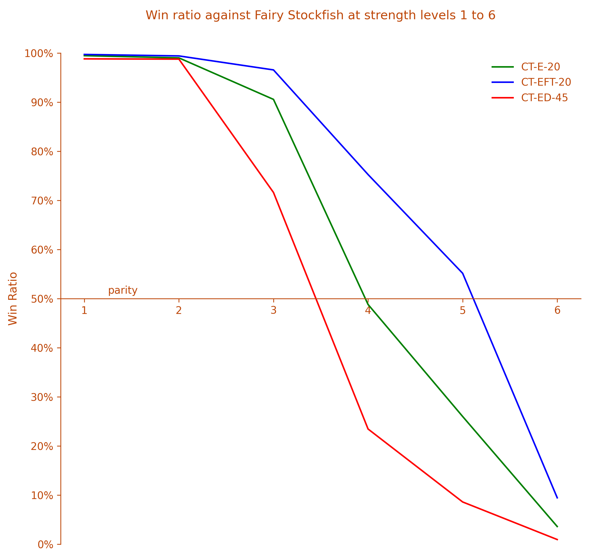
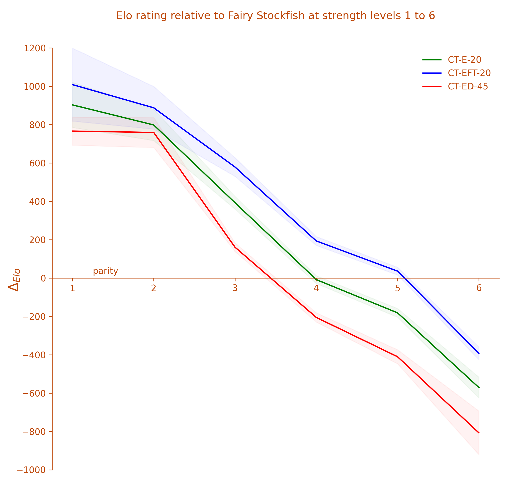
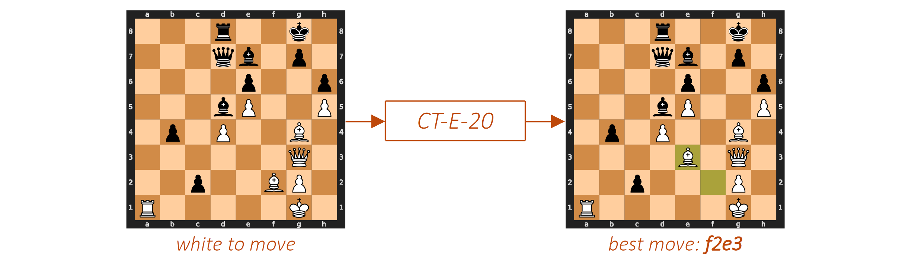
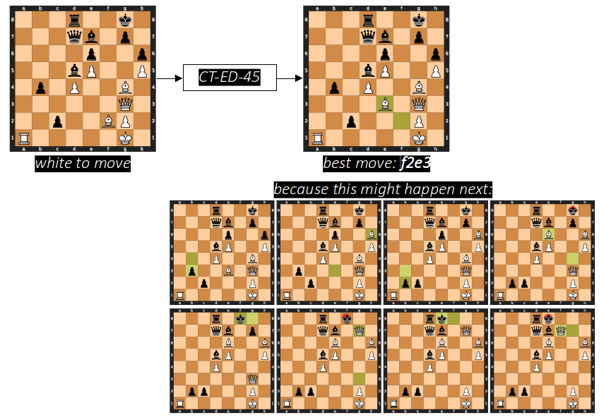
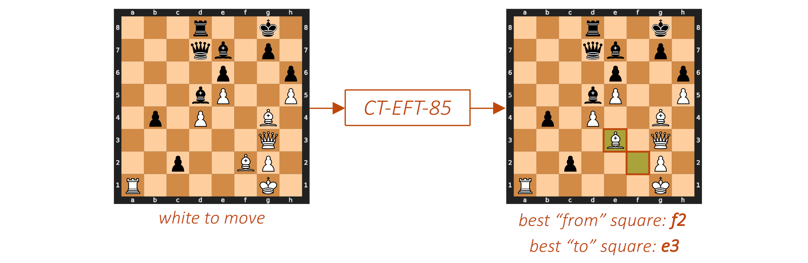

<p align="center">
  
</p>

<h1 align="center"><i>Chess Transformers</i></h1>
<p align="center"><i>Teaching transformers to play chess</i></p>
<p align="center"> <a href="https://github.com/sgrvinod/chess-transformers/releases/tag/v0.4.0"></a> <a href="https://github.com/sgrvinod/chess-transformers/blob/main/LICENSE"></a></p>
<br>

*Chess Transformers* is a library for training transformer models to play chess by learning from human games. 

## Contents

[**Install**](#install)

[**Models**](#models)

[**Datasets**](#datasets)

[**Play**](#play)

[**Train Models**](#train-models)

[**Contribute**](#contribute)


## Install

To install *Chess Transformers*, clone this repository and install as a Python package locally.

```
gh repo clone sgrvinod/chess-transformers
cd chess-transformers
pip install .
```

If you are planning to develop or contribute or make changes to the codebase, install the package in <ins>editable mode</ins>, using the `-e` flag.

```
pip install -e .
```

**OPTIONAL** — If you want to train or evaluate a model, you may need to set some of the following environment variables on your computer:

  - Set **`CT_DATA_FOLDER`** to the folder on your computer where you have the training data. You <ins>do not</ins> need to set this if you do not plan to train any models. 

  - Set **`CT_STOCKFISH_PATH`** to the executable of the Stockfish 16 chess engine. You <ins>do not</ins> need to set this if you do not plan to have a model play against this chess engine.

  - Set **`CT_FAIRY_STOCKFISH_PATH`** to the executable of the Fairy Stockfish chess engine. You <ins>do not</ins> need to set this if you do not plan to have a model play against this chess engine.

## Models

There are currently four models available for use in *Chess Transformers*.

|          Model Name           | # Params |      Training Data      |            Architecture             |                                                                 Predictions                                                                  |
| :---------------------------: | :------: | :---------------------: | :---------------------------------: | :------------------------------------------------------------------------------------------------------------------------------------------: |
|   [***CT-E-20***](#ct-e-20)   |   20M    | [***LE22ct***](#le22ct) |      Transformer encoder only       |                                                 Best next half-move (or ply) <br> eg. *f2e3*                                                 |
| [***CT-EFT-20***](#ct-eft-20) |   20M    | [***LE22ct***](#le22ct) |      Transformer encoder only       |                            Best *From* and *To* squares corresponding to the next half-move eg. from *f2* to *e3*                            |
|  [***CT-ED-45***](#ct-ed-45)  |   45M    | [***LE22ct***](#le22ct) | Transformer encoder <br>and decoder | Sequence of half-moves (or plies) <br> eg. *f2e3* -> *b4b3* -> *e3h6* -> *b3b2* -> *g4e6* -> *g8f8* -> *g3g7* -> *f8e8* -> *g7f7* -> *loses* |
| [***CT-EFT-85***](#ct-eft-85) |   85M    |  [***LE22c***](#le22c)  |      Transformer encoder only       |                            Best *From* and *To* squares corresponding to the next half-move eg. from *f2* to *e3*                            |

All models are evaluated against the [Fairy Stockfish](https://github.com/fairy-stockfish/Fairy-Stockfish) chess engine at increasing strength levels 1 to 6, [as predefined](https://github.com/lichess-org/fishnet/blob/dc4be23256e3e5591578f0901f98f5835a138d73/src/api.rs#L224) for use in the popular Stockfish chess bots on Lichess. The engine is run on an AMD Ryzen 7 3800X 8-Core Processor, with 8 CPU threads, and a hash table size of 8 GB. All other engine parameters are at their default values.

<p align="center">
  
</p>

At each strength level of the chess engine, $n=1000$ games are played by the model, i.e. $500$ games each with black and white pieces. 

Win ratios and the difference between the Elo rating of the model and the chess engine are calculated from these games' outcomes.

<p align="center">
  
</p>

Detailed evaluation results for each model are provided below.

### *CT-E-20*

[**Configuration File**](chess_transformers/configs/models/CT-E-20.py) | [**Checkpoint**](https://chesstransformers.blob.core.windows.net/checkpoints/CT-E-20/averaged_CT-E-20.pt) | 
[**TensorBoard Logs**](https://chesstransformers.blob.core.windows.net/logs/CT-E-20.zip) 

This is the encoder from the original transformer model in [*Vaswani et al. (2017)*](https://arxiv.org/abs/1706.03762) trained on the [*LE22ct*](#le22ct) dataset. A classification head at the **`turn`** token predicts the best half-move to be made (in UCI notation).

<p align="center">
  
</p>

This is essentially a sequence (or image) classification task, where the sequence is the current state of the board, and the classes are the various moves that can be made on a chessboard in UCI notation. 

*CT-E-20* contains about 20 million parameters.

```python
from chess_transformers.play import load_model
from chess_transformers.configs import import_config

CONFIG = import_config("CT-E-20")
model = load_model(CONFIG)
```

You <ins>do not</ins> need to download the model checkpoint manually. It will be downloaded automatically if required.

#### Model Strength

*CT-E-20* was evaluated against the [Fairy Stockfish](https://github.com/fairy-stockfish/Fairy-Stockfish) chess engine at various strength levels [as predefined](https://github.com/lichess-org/fishnet/blob/dc4be23256e3e5591578f0901f98f5835a138d73/src/api.rs#L224) for use in the popular Stockfish chess bots on Lichess. The engine is run on an AMD Ryzen 7 3800X 8-Core Processor, with 8 CPU threads, and a hash table size of 8 GB. All other engine parameters are at their default values.

These evaluation games can be viewed [here](chess_transformers/evaluate/games/CT-E-20/).

| Strength Level | Games | Wins  | Losses | Draws |          Win Ratio          |      Elo Difference      | Likelihood of Superiority |
| :------------: | :---: | :---: | :----: | :---: | :-------------------------: | :----------------------: | :-----------------------: |
|      $LL$      |  $n$  |  $w$  |  $l$   |  $d$  | $\frac{w + \frac{d}{2}}{n}$ |      $\Delta_{Elo}$      |           $LOS$           |
|     **1**      | 1000  |  989  |   0    |  11   |         **99.45%**          | 902.90 <br> *(± 117.67)* |          100.00%          |
|     **2**      | 1000  |  980  |   0    |  20   |         **99.00%**          | 798.25 <br> *(± 81.48)*  |          100.00%          |
|     **3**      | 1000  |  872  |   61   |  67   |         **90.55%**          | 392.58 <br> *(± 33.31)*  |          100.00%          |
|     **4**      | 1000  |  431  |  455   |  114  |         **48.80%**          |  -8.34 <br> *(± 20.30)*  |          21.00%           |
|     **5**      | 1000  |  205  |  685   |  110  |         **26.00%**          | -181.70 <br> *(± 22.78)* |           0.00%           |
|     **6**      | 1000  |  24   |  952   |  24   |          **3.60%**          | -571.11 <br> *(± 54.08)* |           0.00%           |


### *CT-EFT-20*

[**Configuration File**](chess_transformers/configs/models/CT-EFT-20.py) | [**Checkpoint**](https://chesstransformers.blob.core.windows.net/checkpoints/CT-EFT-20/averaged_CT-EFT-20.pt) | 
[**TensorBoard Logs**](https://chesstransformers.blob.core.windows.net/logs/CT-EFT-20.zip) 

This is the encoder from the original transformer model in [*Vaswani et al. (2017)*](https://arxiv.org/abs/1706.03762) trained on the [*LE22ct*](#le22ct) dataset. Two classification heads operate upon the encoder outputs at all chessboard squares to predict the best candidates for the source (*From*) and destination (*To*) squares that correspond to the best half-move to be made.

<p align="center">
  
</p>

This is essentially a sequence (or image) labeling task, where the sequence is the current state of the chessboard, and each square competes to be labeled as the *From* or *To* square.

*CT-E-20* contains about 20 million parameters.

```python
from chess_transformers.play import load_model
from chess_transformers.configs import import_config

CONFIG = import_config("CT-EFT-20")
model = load_model(CONFIG)
```

You <ins>do not</ins> need to download the model checkpoint manually. It will be downloaded automatically if required.

#### Model Strength

*CT-EFT-20* was evaluated against the [Fairy Stockfish](https://github.com/fairy-stockfish/Fairy-Stockfish) chess engine at various strength levels [as predefined](https://github.com/lichess-org/fishnet/blob/dc4be23256e3e5591578f0901f98f5835a138d73/src/api.rs#L224) for use in the popular Stockfish chess bots on Lichess. The engine is run on an AMD Ryzen 7 3800X 8-Core Processor, with 8 CPU threads, and a hash table size of 8 GB. All other engine parameters are at their default values.

These evaluation games can be viewed [here](chess_transformers/evaluate/games/CT-EFT-20/).

| Strength Level | Games | Wins  | Losses | Draws |          Win Ratio          |      Elo Difference       | Likelihood of Superiority |
| :------------: | :---: | :---: | :----: | :---: | :-------------------------: | :-----------------------: | :-----------------------: |
|      $LL$      |  $n$  |  $w$  |  $l$   |  $d$  | $\frac{w + \frac{d}{2}}{n}$ |      $\Delta_{Elo}$       |           $LOS$           |
|     **1**      | 1000  |  994  |   0    |   6   |         **99.70%**          | 1008.63 <br> *(± 190.18)* |          100.00%          |
|     **2**      | 1000  |  988  |   0    |  12   |         **99.40%**          | 887.69 <br> *(± 111.13)*  |          100.00%          |
|     **3**      | 1000  |  942  |   11   |  47   |         **96.55%**          |  578.77 <br> *(± 48.57)*  |          100.00%          |
|     **4**      | 1000  |  697  |  192   |  111  |         **75.25%**          |  193.17 <br> *(± 23.08)*  |          100.00%          |
|     **5**      | 1000  |  482  |  379   |  139  |         **55.15%**          |  35.91 <br> *(± 20.09)*   |          99.98%           |
|     **6**      | 1000  |  61   |  872   |  67   |          **9.45%**          | -392.58 <br> *(± 33.31)*  |           0.00%           |


### *CT-ED-45*

[**Configuration File**](chess_transformers/configs/models/CT-ED-45.py) | [**Checkpoint**](https://chesstransformers.blob.core.windows.net/checkpoints/CT-ED-45/averaged_CT-ED-45.pt) | 
[**TensorBoard Logs**](https://chesstransformers.blob.core.windows.net/logs/CT-ED-45.zip) 

This is the original transformer model (encoder *and* decoder) in [*Vaswani et al. (2017)*](https://arxiv.org/abs/1706.03762) trained on the [*LE22ct*](#le22ct) dataset. A classification head after the last decoder layer predicts a sequence of half-moves, starting with the best half-move to be made next, followed by the likely course of the game an arbitrary number of half-moves into the future. 

<p align="center">
  
</p>

This is essentially a sequence-to-sequence (or image-to-sequence) task, where the input sequence is the current state of the board, and the output sequence is a string of half-moves that will likely occur on the board from that point onwards. Potentially, strategies applied to such tasks, such as beam search for decoding the best possible sequence of half-moves, can also be applied to this model. Training the model to predict not only the best half-move to make on the board right now, but also the sequence of half-moves that follow, can be viewed as a type of multitask training. 

We are ultimately only interested in the very first half-move. Nevertheless, the full sequence of half-moves might help explain the model's decision for this important first half-move.

*CT-ED-45* contains about 45 million parameters.

```python
from chess_transformers.play import load_model
from chess_transformers.configs import import_config

CONFIG = import_config("CT-ED-45")
model = load_model(CONFIG)
```
You <ins>do not</ins> need to download the model checkpoint manually. It will be downloaded automatically if required.

#### Model Strength

*CT-ED-45* was evaluated against the [Fairy Stockfish](https://github.com/fairy-stockfish/Fairy-Stockfish) chess engine at various strength levels [as predefined](https://github.com/lichess-org/fishnet/blob/dc4be23256e3e5591578f0901f98f5835a138d73/src/api.rs#L224) for use in the popular Stockfish chess bots on Lichess. The engine is run on an AMD Ryzen 7 3800X 8-Core Processor, with 8 CPU threads, and a hash table size of 8 GB. All other engine parameters are at their default values.

| Strength Level | Games | Wins  | Losses | Draws |          Win Ratio          |      Elo Difference       | Likelihood of Superiority |
| :------------: | :---: | :---: | :----: | :---: | :-------------------------: | :-----------------------: | :-----------------------: |
|      $LL$      |  $n$  |  $w$  |  $l$   |  $d$  | $\frac{w + \frac{d}{2}}{n}$ |      $\Delta_{Elo}$       |           $LOS$           |
|     **1**      | 1000  |  976  |   0    |  24   |         **98.80%**          |  766.23 <br> *(± 73.45)*  |          100.00%          |
|     **2**      | 1000  |  977  |   2    |  21   |         **98.75%**          |  759.05 <br> *(± 78.19)*  |          100.00%          |
|     **3**      | 1000  |  676  |  244   |  80   |         **71.60%**          |  160.64 <br> *(± 22.72)*  |          100.00%          |
|     **4**      | 1000  |  195  |  726   |  79   |         **23.45%**          | -205.52 <br> *(± 24.04)*  |           0.00%           |
|     **5**      | 1000  |  67   |  895   |  38   |          **8.60%**          | -410.58 <br> *(± 36.41)*  |           0.00%           |
|     **6**      | 1000  |   6   |  987   |   7   |          **0.95%**          | -807.25 <br> *(± 113.69)* |           0.00%           |


### *CT-EFT-85*

[**Configuration File**](chess_transformers/configs/models/CT-EFT-85.py) | [**Checkpoint**](https://chesstransformers.blob.core.windows.net/checkpoints/CT-EFT-85/averaged_CT-EFT-85.pt) | 
[**TensorBoard Logs**](https://chesstransformers.blob.core.windows.net/logs/CT-EFT-85.zip) 

This is a larger version of the encoder from the original transformer model in [*Vaswani et al. (2017)*](https://arxiv.org/abs/1706.03762) trained on the [*LE22c*](#le22c) dataset. Its size is analogous to BERT<sub>BASE</sub> in [*Devlin et al. (2018)*](https://arxiv.org/abs/1810.04805). Two classification heads operate upon the encoder outputs at all chessboard squares to predict the best candidates for the source (*From*) and destination (*To*) squares that correspond to the best half-move to be made.

<p align="center">
  
</p>

This is essentially a sequence (or image) labeling task, where the sequence is the current state of the chessboard, and each square competes to be labeled as the *From* or *To* square.

*CT-E-85* contains about 85 million parameters.

```python
from chess_transformers.play import load_model
from chess_transformers.configs import import_config

CONFIG = import_config("CT-EFT-85")
model = load_model(CONFIG)
```

You <ins>do not</ins> need to download the model checkpoint manually. It will be downloaded automatically if required.

#### Model Strength

*CT-EFT-85* was evaluated against the [Fairy Stockfish](https://github.com/fairy-stockfish/Fairy-Stockfish) chess engine at various strength levels [as predefined](https://github.com/lichess-org/fishnet/blob/dc4be23256e3e5591578f0901f98f5835a138d73/src/api.rs#L224) for use in the popular Stockfish chess bots on Lichess. The engine is run on an AMD Ryzen 7 3800X 8-Core Processor, with 8 CPU threads, and a hash table size of 8 GB. All other engine parameters are at their default values.

These evaluation games can be viewed [here](chess_transformers/evaluate/games/CT-EFT-85/).

| Strength Level | Games | Wins  | Losses | Draws |          Win Ratio          |      Elo Difference       | Likelihood of Superiority |
| :------------: | :---: | :---: | :----: | :---: | :-------------------------: | :-----------------------: | :-----------------------: |
|      $LL$      |  $n$  |  $w$  |  $l$   |  $d$  | $\frac{w + \frac{d}{2}}{n}$ |      $\Delta_{Elo}$       |           $LOS$           |
|     **1**      | 1000  |  999  |   0    |   1   |         **99.95%**          | 1320.33 <br> *(± 34.06)*  |          100.00%          |
|     **2**      | 1000  |  997  |   0    |   3   |         **99.85%**          | 1129.30 <br> *(± 101.08)* |          100.00%          |
|     **3**      | 1000  |  979  |   0    |  21   |         **98.95%**          |  789.69 <br> *(± 79.22)*  |          100.00%          |
|     **4**      | 1000  |  883  |   65   |  52   |         **90.90%**          |  399.81 <br> *(± 34.71)*  |          100.00%          |
|     **5**      | 1000  |  712  |  183   |  105  |         **76.45%**          |  204.55 <br> *(± 23.52)*  |          100.00%          |
|     **6**      | 1000  |  184  |  713   |  103  |         **23.55%**          | -204.55 <br> *(± 23.56)*  |           0.00%           |


## Datasets

There are currently four training datasets available in *Chess Transformers*.

|      Dataset Name       |                                    Components                                    | # Datapoints |
| :---------------------: | :------------------------------------------------------------------------------: | :----------: |
|  [***ML23c***](#ml23c)  | Board positions, turn, castling rights, next-move sequence (up to 10 half-moves) |  10,797,366  |
| [***LE22ct***](#le22ct) | Board positions, turn, castling rights, next-move sequence (up to 10 half-moves) |  13,287,522  |
|  [***LE22c***](#le22c)  | Board positions, turn, castling rights, next-move sequence (up to 10 half-moves) | 127,684,720  |
|  [***ML23d***](#ml23d)  | Board positions, turn, castling rights, next-move sequence (up to 10 half-moves) | 144,625,397  |

These datasets are sourced from groups of PGN files containing real games played by humans. There are currently three PGN filesets:

- ***LE22*** consists of games from the [Lichess Elite Database](https://database.nikonoel.fr/) put together by [nikonoel](https://lichess.org/@/nikonoel), a collection of all standard chess games played on [Lichess.org](https://lichess.org/) by players with a Lichess Elo rating of 2400+ against players with a Lichess Elo rating of 2200+ up to December 2021, and players rated 2500+ against players rated 2300+ from December 2021 up to December 2022
  
- ***ML23*** consists of Master-level games downloaded from [PGN mentor](https://www.pgnmentor.com/files.html), [TWIC](https://theweekinchess.com/twic), and [Caissabase](http://caissabase.co.uk/) in December 2023

The lowercase letters at the end of every dataset denote specific filters that were applied to games from the corresponding PGN filesets:

- "***c*** for games that ended in a checkmate
- "***t***" for games that used a specific time control
- "***d***" for games that ended decisively

### *ML23c*

This consists of Master-level games downloaded from [PGN mentor](https://www.pgnmentor.com/files.html), [TWIC](https://theweekinchess.com/twic), and [Caissabase](http://caissabase.co.uk/) in December 2023.

On this data (11,081,724 games), we apply the following filters to keep only those games that:

- are unique (5,213,634 games) 
- and ended in a checkmate (**250,694 games**)

These 250,694 games consist of a total **10,797,366 half-moves** made by the <ins>winners</ins> of the games, which alone constitute the dataset. For each such half-move, the chessboard, turn (white or black), and castling rights of both players before the move are calculated, as well as the sequence of half-moves beginning with this half-move up to 10 half-moves into the future. Draw potential is not calculated.

[**Download here.**](https://chesstransformers.blob.core.windows.net/data/ML23c.zip) The data is zipped and will need to be extracted.

It consists of the following files:

- **`ML23c.h5`**, an HDF5 file containing two tables, one with the raw data and the other encoded with indices (that will be used in the transformer model), containing the following fields:
  - **`board_position`**, the chessboard layout, or positions of pieces on the board
  - **`turn`**, the color of the pieces of the player to play
  - **`white_kingside_castling_rights`**, whether white can castle kingside
  - **`white_queenside_castling_rights`**, whether white can castle queenside
  - **`black_kingside_castling_rights`**, whether black can castle kingside
  - **`black_queenside_castling_rights`**, whether black can castle queenside
  - **`moves`**, 10 half-moves into the future made by both players
  - **`length`**, the number of half-moves in the sequence, as this will be less than 10 at the end of the game

### *LE22ct*

This consists of games from the [Lichess Elite Database](https://database.nikonoel.fr/) put together by [nikonoel](https://lichess.org/@/nikonoel), a collection of all standard chess games played on [Lichess.org](https://lichess.org/) by players with a Lichess Elo rating of 2400+ against players with a Lichess Elo rating of 2200+ up to December 2021, and players rated 2500+ against players rated 2300+ from December 2021 up to December 2022.

On this data (20,241,368 games), we apply the following filters to keep only those games that:

- used a time control of at least 5 minutes  (2,073,780 games)
- and ended in a checkmate (**274,794 games**)

These 274,794 games consist of a total **13,287,522 half-moves** made by the <ins>winners</ins> of the games, which alone constitute the dataset. For each such half-move, the chessboard, turn (white or black), and castling rights of both players before the move are calculated, as well as the sequence of half-moves beginning with this half-move up to 10 half-moves into the future. Draw potential is not calculated.

[**Download here.**](https://chesstransformers.blob.core.windows.net/data/LE22ct.zip) The data is zipped and will need to be extracted.

It consists of the following files:

- **`LE22ct.h5`**, an HDF5 file containing two tables, one with the raw data and the other encoded with indices (that will be used in the transformer model), containing the following fields:
  - **`board_position`**, the chessboard layout, or positions of pieces on the board
  - **`turn`**, the color of the pieces of the player to play
  - **`white_kingside_castling_rights`**, whether white can castle kingside
  - **`white_queenside_castling_rights`**, whether white can castle queenside
  - **`black_kingside_castling_rights`**, whether black can castle kingside
  - **`black_queenside_castling_rights`**, whether black can castle queenside
  - **`moves`**, 10 half-moves into the future made by both players
  - **`length`**, the number of half-moves in the sequence, as this will be less than 10 at the end of the game

### *LE22c*

This is an extended version of [*LE22ct*](#le22ct), and consists of games from the [Lichess Elite Database](https://database.nikonoel.fr/) put together by [nikonoel](https://lichess.org/@/nikonoel), a collection of all standard chess games played on [Lichess.org](https://lichess.org/) by players with a Lichess Elo rating of 2400+ against players with a Lichess Elo rating of 2200+ up to December 2021, and players rated 2500+ against players rated 2300+ from December 2021 up to December 2022.

On this data (20,241,368 games), we apply the following filters to keep only those games that:

- ended in a checkmate (**2,751,394 games**)

These 2,751,394 games consist of a total **127,684,720 half-moves** made by the <ins>winners</ins> of the games, which alone constitute the dataset. For each such half-move, the chessboard, turn (white or black), and castling rights of both players before the move are calculated, as well as the sequence of half-moves beginning with this half-move up to 10 half-moves into the future. Draw potential is not calculated.

[**Download here.**](https://chesstransformers.blob.core.windows.net/data/LE22c.zip) The data is zipped and will need to be extracted.

It consists of the following files:

- **`LE22c.h5`**, an HDF5 file containing two tables, one with the raw data and the other encoded with indices (that will be used in the transformer model), containing the following fields:
  - **`board_position`**, the board layout or positions of pieces on the board
  - **`turn`**, the color of the pieces of the player to play
  - **`white_kingside_castling_rights`**, whether white can castle kingside
  - **`white_queenside_castling_rights`**, whether white can castle queenside
  - **`black_kingside_castling_rights`**, whether black can castle kingside
  - **`black_queenside_castling_rights`**, whether black can castle queenside
  - **`moves`**, 10 half-moves into the future made by both players
  - **`length`**, the number of half-moves in the sequence, as this will be less than 10 at the end of the game

### *ML23d*

This consists of Master-level games downloaded from [PGN mentor](https://www.pgnmentor.com/files.html), [TWIC](https://theweekinchess.com/twic), and [Caissabase](http://caissabase.co.uk/) in December 2023.

On this data (11,081,724 games), we apply the following filters to keep only those games that:

- are unique (5,213,634 games) 
- and are decisive, i.e. a player won (**3,739,604 games**)

These 3,739,604 games consist of a total **144,625,397 half-moves** made by the <ins>winners</ins> of the games, which alone constitute the dataset. For each such half-move, the chessboard, turn (white or black), and castling rights of both players before the move are calculated, as well as the sequence of half-moves beginning with this half-move up to 10 half-moves into the future. Draw potential is not calculated.

[**Download here.**](https://chesstransformers.blob.core.windows.net/data/ML23d.zip) The data is zipped and will need to be extracted.

It consists of the following files:

- **`ML23d.h5`**, an HDF5 file containing two tables, one with the raw data and the other encoded with indices (that will be used in the transformer model), containing the following fields:
  - **`board_position`**, the chessboard layout, or positions of pieces on the board
  - **`turn`**, the color of the pieces of the player to play
  - **`white_kingside_castling_rights`**, whether white can castle kingside
  - **`white_queenside_castling_rights`**, whether white can castle queenside
  - **`black_kingside_castling_rights`**, whether black can castle kingside
  - **`black_queenside_castling_rights`**, whether black can castle queenside
  - **`moves`**, 10 half-moves into the future made by both players
  - **`length`**, the number of half-moves in the sequence, as this will be less than 10 at the end of the game

## Play

After [installing](#install) *Chess Transformers*, you can play games <ins>against an available model</ins> or have a model play <ins>against a chess engine</ins>.

### You v. Model

You could either play in a Jupyter notebook (recommended for better UI) or in a Python shell. 

```python
import os
from chess_transformers.configs import import_config
from chess_transformers.play.utils import write_pgns
from chess_transformers.play import load_model, warm_up, human_v_model 

# Load configuration
config_name = "CT-EFT-85"
CONFIG = import_config(config_name)

# Load assets
model = load_model(CONFIG)

# Warmup model (triggers compilation)
warm_up(
    model=model
)

# Play
wins, losses, draws, pgns = human_v_model(
    human_color="b",  # color you want to play
    model=model,
    k=1,  # "k" in "top_k sampling", k=1 is best
    use_amp=True,
    rounds=1,  # number of rounds you want to play
    clock=None, 
    white_player_name=config_name,
    black_player_name="Me",
)

# Print games in Portable Game Notation (PGN) format
print(pgns)

# Save PGNs if you wish
write_pgns(
    pgns,
    pgn_file="somewhere/something.pgn",
)
```

You could also just make a copy of [**`human_play.ipynb`**](chess_transformers/play/human_play.ipynb) and play in that notebook.

### Model v. Engine

The process is the same as above, except you must use a different set of functions:

```python
from chess_transformers.play import model_v_engine
from chess_transformers.play.utils import load_engine

# Load engine
engine = load_engine(CONFIG.FAIRY_STOCKFISH_PATH)

# Play
LL = 1  # Try strength levels 1 to 8 (note: 7 and 8 may be slow)
model_color = "w"  # Try "w" and "b"
wins, losses, draws, pgns = model_v_engine(
    model=model,
    k=CONFIG.SAMPLING_K,
    use_amp=CONFIG.USE_AMP,
    model_color=model_color,
    engine=engine,
    time_limit=CONFIG.LICHESS_LEVELS[LL]["TIME_CONSTRAINT"],
    depth_limit=CONFIG.LICHESS_LEVELS[LL]["DEPTH"],
    uci_options={"Skill Level": CONFIG.LICHESS_LEVELS[LL]["SKILL"]},
    rounds=500,
    clock=None,
    white_player_name="Fairy Stockfish @ LL {}".format(LL)
    if model_color == "b"
    else config_name,
    black_player_name="Fairy Stockfish @ LL {}".format(LL)
    if model_color == "w"
    else config_name,
    event=config_name + " v. Fairy Stockfish @ LL {}".format(LL)
    if model_color == "w"
    else "Fairy Stockfish @ LL {} v. ".format(LL) + config_name,
)
```
See [**`evaluate.py`**](chess_transformers/evaluate/evaluate.py) for an example.

### Time Control

If you're using a *Unix*-type operating system — basically, not Windows — you can also set a time control for your games. 
Currently, only Fischer time control is available. 

```python
from chess_transformers.play.clocks import ChessClock

clock = ChessClock(base_time=60, 
                   increment=1)
```

Pass this **`clock`** to the functions above instead of **`clock=None`**.

## Train Models

You're welcome to try to train your own models, but if you wish to contribute trained models, please [discuss first](#contribute).

### Dataset

You can skip this step if you wish to use one of the [existing datasets](#datasets).

- Collect PGN files containing games you wish to use for training the model.

- Create a bash script for parsing these PGN files into a collection of FENs and moves using [*pgn-extract*](https://www.cs.kent.ac.uk/people/staff/djb/pgn-extract/), like in [**`LE22ct.sh`**](#le22ct), and execute it in the folder with the PGN files.

- Create a configuration file for the dataset, like in [**`LE22ct.py`**](chess_transformers/configs/data/LE22ct.py).

- Run [**`prep.py`**](chess_transformers/data/prep.py) like `python prep.py [config_name]`, or do it in your own Python script.

```python
from chess_transformers.data import prepare_data
from chess_transformers.configs import import_config

# Load configuration
CONFIG = import_config("[config_name]")

# Prepare data
prepare_data(
    data_folder=CONFIG.DATA_FOLDER,
    h5_file=CONFIG.H5_FILE,
    max_move_sequence_length=CONFIG.MAX_MOVE_SEQUENCE_LENGTH,
    expected_rows=CONFIG.EXPECTED_ROWS,
    val_split_fraction=CONFIG.VAL_SPLIT_FRACTION,
)
```
Data files will be created in **`CONFIG.DATA_FOLDER`**.

### Training

- Create a configuration file for the model, like in [**`CT-E-20.py`**](chess_transformers/configs/models/CT-E-20.py).

- Run [**`train.py`**](chess_transformers/train/train.py) like `python train.py [config_name]`, or do it in your own Python script.

```python

from chess_transformers.train import train_model
from chess_transformers.configs import import_config

# Load configuration
CONFIG = import_config("[config_name]")

# Train model
train_model(CONFIG)
```
- Monitor training with [*TensorBoard*](https://www.tensorflow.org/tensorboard) with `tensorboard --logdir $CT_LOGS_DIR`.

- Average checkpoints saved for averaging to produce the final checkpoint. Run [**`average_checkpoints.py`**](chess_transformers/train/average_checkpoints.py) like `python average_checkpoints.py [config_name]`, or do it in your own Python script.
  
```python

from chess_transformers.train import average_checkpoints
from chess_transformers.configs import import_config

# Load configuration
CONFIG = import_config("[config_name]")

# Average checkpoints
average_checkpoints(
    checkpoint_folder=CONFIG.CHECKPOINT_FOLDER,
    checkpoint_avg_prefix=CONFIG.CHECKPOINT_AVG_PREFIX,
    checkpoint_avg_suffix=CONFIG.CHECKPOINT_AVG_SUFFIX,
    final_checkpoint=CONFIG.FINAL_CHECKPOINT,
)
```

### Evaluation

Run [**`evaluate.py`**](chess_transformers/evaluate/evaluate.py) like `python evaluate.py [config_name]`, or do it in your own Python notebook/script.

```python

from chess_transformers.configs import import_config
from chess_transformers.evaluate import evaluate_model

# Load configuration
CONFIG = import_config("[config_name]")

# Evaluate model
evaluate_model(CONFIG)
```

## Contribute

Contributions — and any discussion thereof — are welcome. As you may have noticed, *Chess Transformers* is in initial development and the public API is <ins>not</ins> to be considered stable. 

If you are planning to contribute bug-fixes, please go ahead and do so. If you are planning to contribute in a way that extends *Chess Transformers*, or adds any new features, data, or models, please [create a discussion thread](https://github.com/sgrvinod/chess-transformers/discussions/new/choose) to discuss it <ins>before</ins> you spend any time on it. Otherwise, your PR may be rejected due to lack of consensus or alignment with current goals.

Presently, the following types of contributions may be useful:

- Better, more robust evaluation methods of models.
- Evaluation of existing models against chess engines on different CPUs to study the effect of CPU specifications on engine strength and evaluation.
- New models with:
  - the same transformer architectures but of a larger size, and trained on larger datasets.
  - or different transformer architectures or internal mechanisms.
  - or in general, improved evaluation scores.
- Chess clocks for Windows OS, or for *Unix*-type OS but for time controls <ins>other than</ins> Fischer time control.
- Refactoring of code that improves its ease of use.
- Model visualization for explainable AI, such as visualizing positional and move embeddings, or attention patterns.

This list is not exhaustive. Please do not hesitate to discuss your ideas. Thank you!

## License

*Chess Transformers* is licensed under the [MIT license](LICENSE). 


